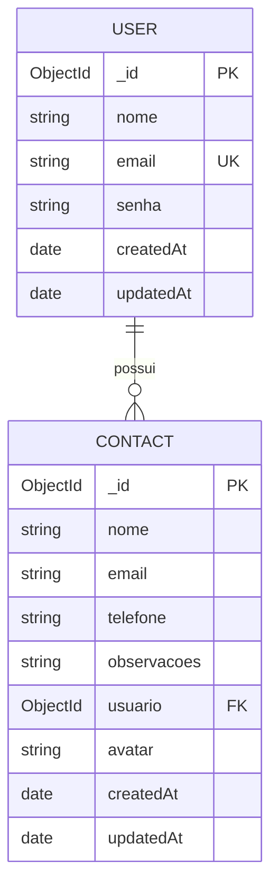

```mermaid
erDiagram
    USER {
        ObjectId _id PK
        string nome
        string email UK
        string senha
        date createdAt
        date updatedAt
    }

    CONTACT {
        ObjectId _id PK
        string nome
        string email
        string telefone
        string observacoes
        ObjectId usuario FK
        string avatar
        date createdAt
        date updatedAt
    }

    USER ||--o{ CONTACT : "possui"
```
